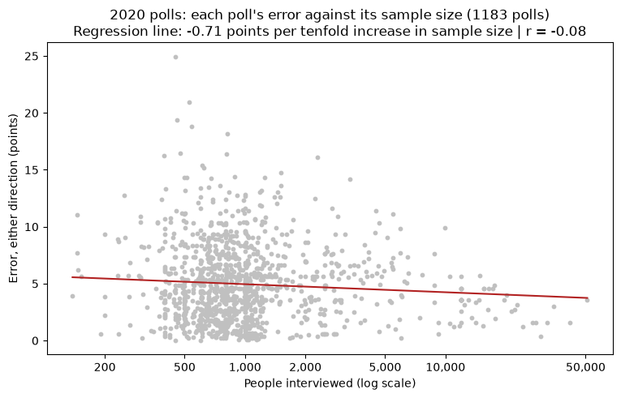
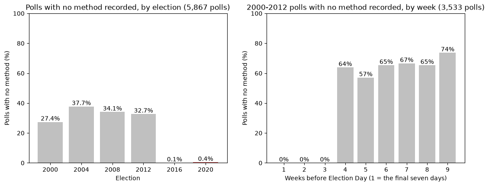
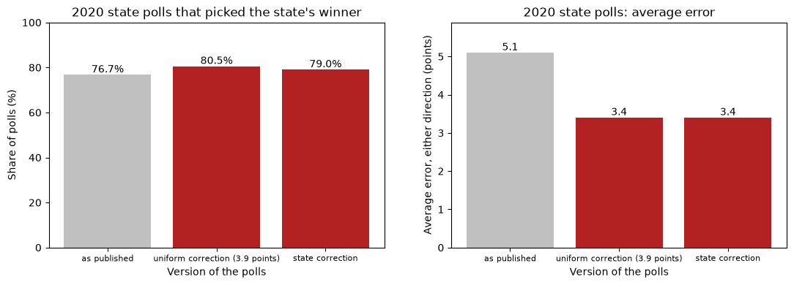
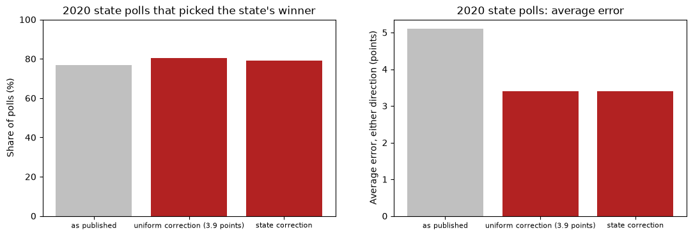
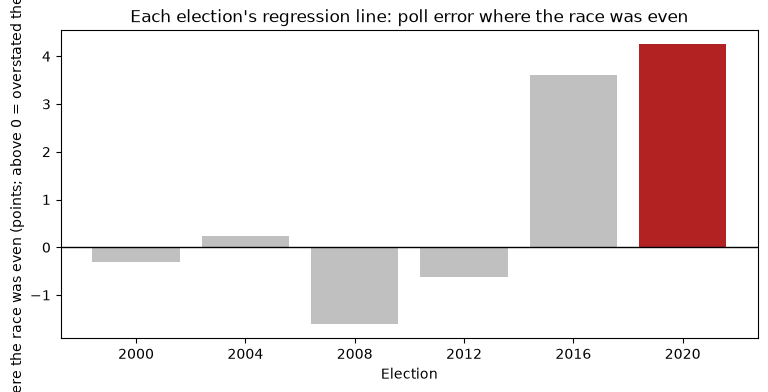
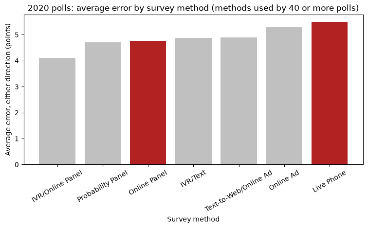

# Figure examples

Three figures that meet every rule in `SKILL.md`, and three that break at least one. All six come
from the 2020 polls case study (public data from FiveThirtyEight and the MIT Election Data and
Science Lab), as drawn in its notebooks; the images are in `images/`.

The rules each one is checked against:

1. **Plot type** fits the variables and the question.
2. **Title** names what the figure shows.
3. **Axis labels** in plain language, with the unit and, for a signed quantity, the direction.
4. **Ticks** carry real values; every bar is labelled.
5. **Reference lines** are labelled.
6. **The numbers that matter** are on the figure.
7. **Nothing overlaps** or is cut off.
8. **Integrity**: bars start at zero; panels meant to be compared share an axis; the count of cases
   is visible (on the figure or in the table beside it).
9. **Color** follows what the data is doing; a highlight marks the case asked about, and the figure
   says what it means.
10. **The five-step description** (topic, y-axis, x-axis, what each mark is, the takeaway) can be
    completed from the figure alone.

## Good 1: every poll's error against its sample size

| Rule | How the figure meets it |
|---|---|
| Plot type | Two numeric variables, so a scatter with a regression line. Every poll is drawn, not four group averages, so the reader sees the spread. |
| Title | "2020 polls: each poll's error against its sample size (1183 polls)". |
| Axis labels | "People interviewed (log scale)"; "Error, either direction (points)". The error has no sign, so no direction is needed. |
| Ticks | Plain numbers on the log axis (200, 500, 1,000 to 50,000), not powers of ten. |
| Reference lines | The regression line, described in the title's second line. |
| Numbers on the figure | Slope (-0.71 points per tenfold increase), r (-0.08), and the poll count. |
| Nothing overlaps | Title, points, and line are all clear. |
| Integrity | The y-axis starts at 0; the count is in the title. |
| Color | Silver points and one firebrick line: the eye goes to the fitted line. |
| Five-step description | Topic: 2020 poll error and sample size. Y: each poll's error in points. X: people interviewed, log scale. Each point: one poll. Takeaway: the line is nearly flat (r = -0.08), so sample size barely relates to error. |

## Good 2: polls with no survey method recorded

| Rule | How the figure meets it |
|---|---|
| Plot type | One summary (the share missing) per group (election; week before the election), so bars. |
| Title | Each panel names what it shows and how many polls it covers (5,867; 3,533). |
| Axis labels | "Polls with no method (%)"; "Election"; "Weeks before Election Day (1 = the final seven days)", which explains how to read the ticks. |
| Ticks | Every bar has its own label. |
| Reference lines | None needed. |
| Numbers on the figure | The share on every bar, so no one estimates from the axis. |
| Nothing overlaps | Value labels sit above the bars; the panels have their own space. |
| Integrity | Bars start at zero, and both panels run 0 to 100 percent, so they can be compared directly. |
| Color | 2020, the election the case is about, in firebrick, as in every figure in the notebook; the rest grey. |
| Five-step description | Topic: polls with no method recorded. Y: the share of polls. X: the election, then the week before it. Each bar: one election or one week. Takeaway: the blanks fall in 2000-2012 and in polls taken four or more weeks out; none in the final three weeks. |

## Good 3: correcting the 2020 polls

| Rule | How the figure meets it |
|---|---|
| Plot type | One summary per version of the polls, two measures, so two bar panels. |
| Title | "2020 state polls that picked the state's winner"; "2020 state polls: average error". |
| Axis labels | "Version of the polls"; "Share of polls (%)"; "Average error, either direction (points)". |
| Ticks | Each version named, with the size of the uniform correction (3.9 points). |
| Reference lines | None needed. |
| Numbers on the figure | Every bar's value (76.7%, 80.5%, 79.0%; 5.1, 3.4, 3.4). |
| Nothing overlaps | Clear at this size. |
| Integrity | Bars start at zero, and the share axis runs to 100, so a 4-point gain is not drawn as a doubling. The count (921 polls) is in the table printed beside the figure. |
| Color | Grey for the polls as published, firebrick for the two corrections being tested; the tick labels name them as corrections, so the color's meaning is on the figure. |
| Five-step description | Topic: published against corrected 2020 state polls. Y: share that picked the winner, and average error. X: the version. Each bar: one version. Takeaway: either correction cut the average error from 5.1 to 3.4 points but raised the share picking the winner only from 76.7% to about 80%. |

## Bad 1: the same chart before it was fixed

**Rules broken:**
- **Axis labels:** the x-axis has no label, so the reader has to guess what "as published" and
  "state correction" are versions of.
- **Numbers on the figure:** the values that decide the comparison (77 against 80 against 79
  percent) are not on the bars; the reader estimates them from the axis.

It passes on title, y-axis labels, and bars starting at zero. The fix is Good 3: an x-axis label
and the value on every bar.

## Bad 2: an axis label cut off

**Rules broken:**
- **Nothing cut off:** the y-axis label runs past both ends of the figure. What survives reads
  "...re the race was even (points; above 0 = overstated the...".
- **Axis labels:** because of that, the reader cannot tell what is measured or which way is up: the
  direction ("above 0 = overstated the Democrat") is the part that was lost.
- **Numbers on the figure:** no values on the bars.

It passes on title, x-axis, the zero line, and the 2020 highlight. The fix: a shorter label, or one
wrapped onto two lines, a taller figure, and values on the bars. Only the rendered image shows this
problem, which is why every figure has to be looked at.

## Bad 3: a highlight that says nothing

**Rules broken:**
- **Color:** two of seven bars are firebrick, Online Panel and Live Phone, and nothing on the
  figure gives the reason. They are the two methods the hypothesis compares; a reader without the notebook
  would guess they are the best or the worst.
- **Five-step description:** step 4, what each mark represents, cannot be completed: the reader
  does not know what red means.
- **Numbers on the figure:** the two values being compared (4.8 and 5.5 points) are not shown.

It passes on title, axis labels, readable rotated ticks, and bars starting at zero. The fix: say it
in the title or a legend ("live phone and online panel, the two methods the hypothesis compares, in
red") and put the values on the bars.

## Shorter fixes

- **Words instead of values as ticks.** The first chart of error by sample size had no title, a
  y-axis reading "Average miss (points)", and ticks reading "smallest", "small", "large",
  "largest". Real ranges as ticks ("138 to 637") fix the ticks, but the better figure for a
  numeric predictor is Good 1: every case, with the regression line.
- **A truncated axis.** The share of polls that picked the winner, drawn with the y-axis running
  from 70% to 85%, made a 3-point difference look like a doubling. Run a share axis from 0 to 100.
- **Every other tick.** Bars for weeks 1 to 9 had ticks only at 2, 4, 6, 8, because the x values
  were integers and matplotlib chose the ticks. Pass the categories as strings
  (`by_week.index.astype(str)`) so every bar is labelled.
- **Titles colliding.** Two side-by-side scatters with two-line titles ran into each other. Stack
  them: `plt.subplots(2, 1, figsize=(9, 11))` with `fig.subplots_adjust(hspace=0.45)`.
- **A legend on the data.** A legend in the upper left sat over the tallest bar. Move it to the
  empty corner and add headroom with `ax.set_ylim(top=ax.get_ylim()[1] * 1.3)`.
- **A matched pair that was not matched.** The first variable by day as a bar chart, the second as a
  line chart in another section. Draw the second as the same bar chart, immediately after the first.
